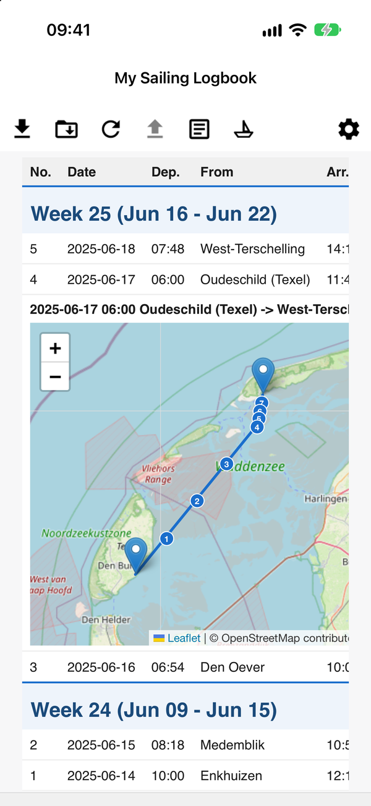
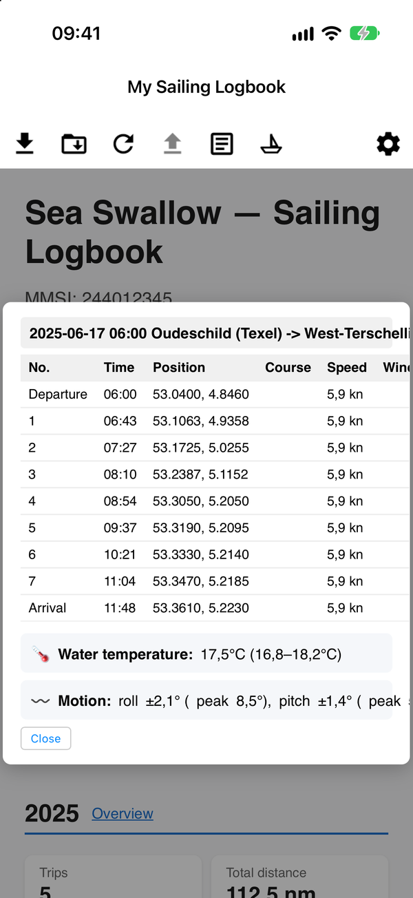
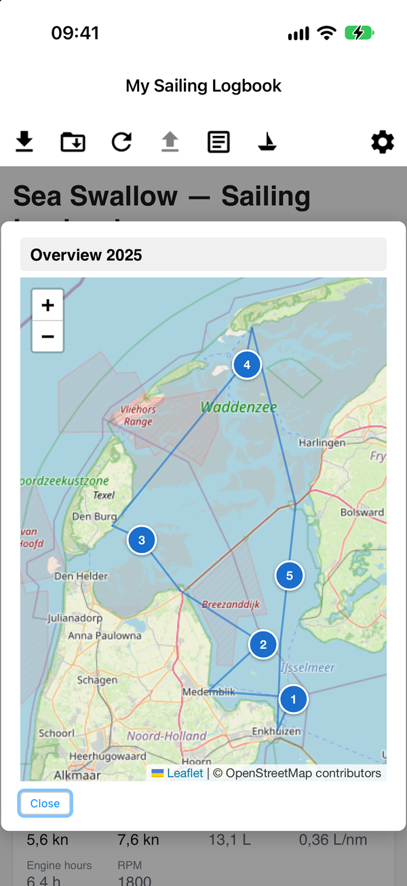
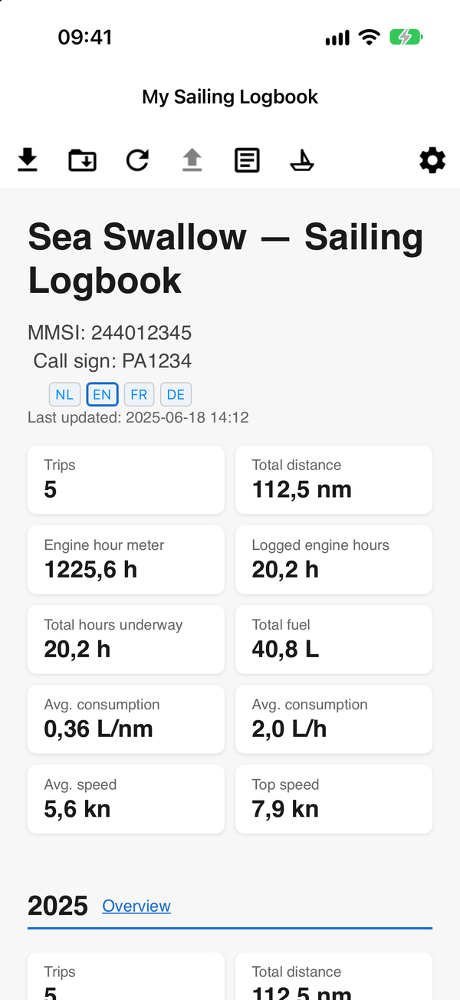
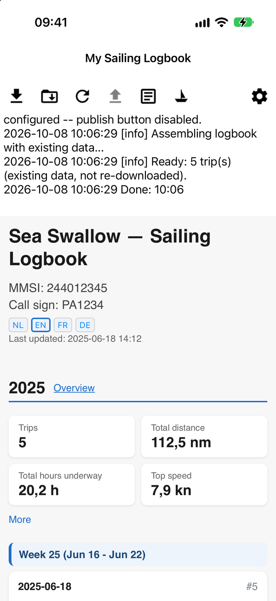
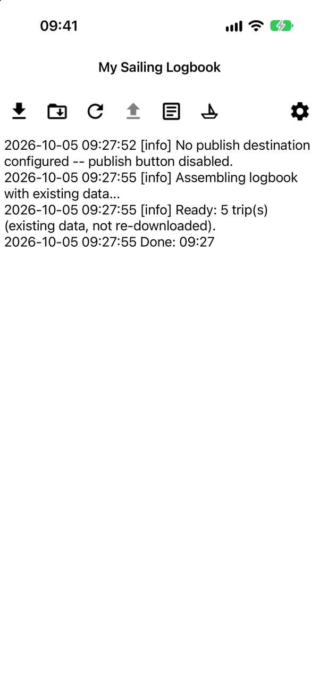
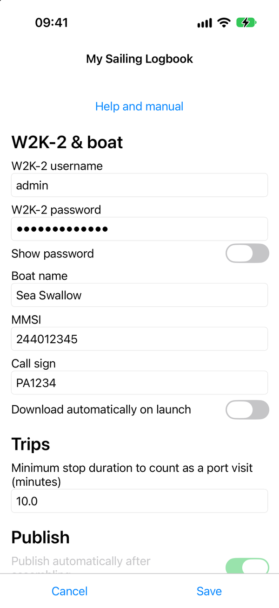
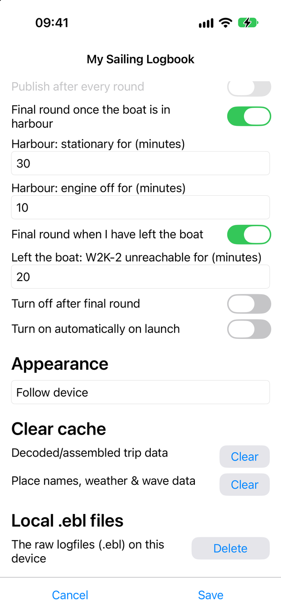
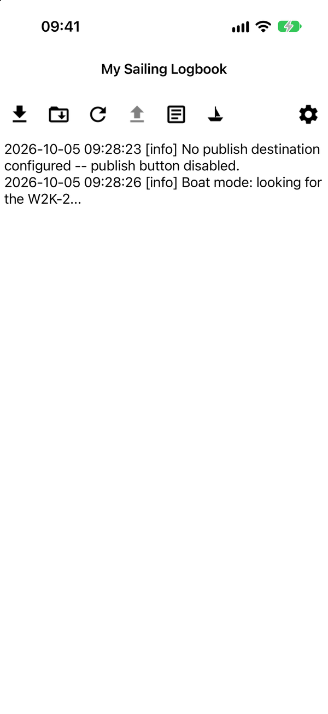

# My Sailing Logbook (iOS)

iOS counterpart to [mysailinglogbook-android](https://github.com/Ayuus/mysailinglogbook-android): downloads
voyage data from a boat's [Actisense W2K-2](https://actisense.com) NMEA 2000-to-WiFi gateway,
assembles the same HTML sailing logbook the desktop [nmea2log](https://github.com/Ayuus/nmea2log)
CLI produces, shows it in-app, and (optionally) publishes it to a WordPress site. An optional "boat mode" can also do
all of the above on its own, on an interval -- see "Using the app" below. Same feature set as the Android app, same
underlying `nmea2log` Python package, different platform.

It does **not** reimplement any of the NMEA 2000 decoding, trip-building, or HTML-generation logic: it embeds the real
`nmea2log` Python package (via [Briefcase](https://github.com/beeware/briefcase)/[Toga](https://github.com/beeware/toga))
and drives it from Python. A fix or feature added to `nmea2log` is picked up by this app on the next `briefcase update` --
there is no copy to keep in sync.

**Looking for testers**: the iOS app works on a real iPhone, but it is not on the App Store or TestFlight yet (my Apple
Developer account is not validated yet), so for now it is installed from source with Xcode -- see Building. So far it
has only been run against one boat's NMEA2000 network (a **motorboat**, one Actisense W2K-2). Other boats/instrument
mixes will likely surface issues this setup never hits. Sailboat support in particular is on the wishlist but untested
so far -- see the same note in the [nmea2log README](https://github.com/Ayuus/nmea2log#readme) for why. Feedback is very
welcome via [GitHub issues](https://github.com/Ayuus/mysailinglogbook-ios/issues).

## Screenshots

Taken in the simulator in English, with the fictional trips of the demo logbook (a made-up boat, "Sea Swallow", not a
real one) -- generated with `examples/generate_demo_logbook.py` in the
[nmea2log](https://github.com/Ayuus/nmea2log) repo.

<p>



</p>

*The maps in the logbook (OpenStreetMap): the **Map** button of a trip shows its route -- its **Log** button the positions, course and speed along the way, with the water temperature and the boat's motion -- the **Overview** link of a year puts all trips of that year on one map.*

<p>



</p>

*The logbook (what the app shows when it is opened) -- after an assemble, the logbook with the log as a strip above it
(scroll it, or tap the log button for the whole log) -- the start of the log of such a run: the .ebl files found, the
trips assembled from them.*

<p>


</p>

*Settings (top and bottom).*

<p>

</p>

*Boat mode on: the sailboat button is filled and the log reports what it is doing.*

## Installation

**App Store / TestFlight**: not yet (see "Looking for testers" above).

**From source**: install it on your own iPhone (or the Simulator) with Xcode -- see Building. Requires iOS 15.0 or newer.

## Using the app

### First-time setup

Open Settings (the gear icon, top right of the toolbar) and fill in:

- **W2K-2 username/password** -- the same login the W2K-2's own web interface uses.
- **Boat name, MMSI, call sign** -- shown in the logbook's header, not sent anywhere by themselves.
- **Publishing** (optional) -- pick "Publish via WordPress" under **Publish method** and enter a WordPress Application
  Password (for an account in the `logboek_editor` role) plus your site's address (`your-site.example` is enough: the app
  adds `https://` and the REST route `/wp-json/nmea2log/v1/logbook` itself; an address that already contains `/wp-json/`
  is used as typed), if you want the built logbook sent to your own website. Not the address of the logbook's own page:
  that gets redirected to a login page instead of uploading anything (the app reports that as an error). See the
  `nmea2log` README's own "Per-trip remarks, login-gated, via WordPress" section for the WordPress side of this setup.
  Leave it on "Don't publish" to keep everything on the phone -- picking "Don't publish" keeps the WordPress details you
  typed, so switching back finds them again.
- **Local `.ebl` files** (Settings, at the bottom) -- a **Delete** button that removes the raw `.ebl` logfiles from the
  phone to free its storage, after a confirmation that says how many files and how much space. The logbook already
  built stays; a new download fetches the files from the W2K-2 again, and no new logbook can be assembled without them.
  (The Python side, `nmea2log.ebl_storage`, is shared with the Android app.)

The first time, iOS asks for permission to use the local network (to find the W2K-2) and, with boat mode, to send
notifications.

The phone needs to share a private network with the W2K-2 -- normally that means the iPhone's Personal Hotspot with the
W2K-2 joined to it as a client (the setup the W2K-2's own app expects), but any shared network works just as well, e.g.
phone and W2K-2 both joined to the same marina/router WiFi instead. Either way the app only scans whatever private subnet
the phone itself is currently on, never the internet. Boat mode's auto-start (below) starts whenever the app is opened on
any private network (the Android app only does so when its own hotspot is on).

### The toolbar

Left to right: **download** (fetch new data from the W2K-2 and assemble the logbook), **import**
(copy `.ebl` files from an SD card or USB drive instead -- no W2K-2 needed, e.g. a card pulled
straight from the instrument -- then assemble/publish exactly like a normal download would), **assemble**
(assemble the logbook again from whatever's already on the phone, no W2K-2 needed -- useful to pick
up a settings change, or just to see the logbook without being near the boat), **publish** (send
the logbook to the website configured in Settings; it is sent as it is when it is up to date, and assembled
first when a .ebl file is newer than it or a setting that ends up in it has changed), **view logbook** (show the
already-built logbook full-screen, toggles back to the log), **boat mode** (see below), and
**settings**.

A long-running action (download/assemble/publish) shows a pulsing version of its own button --
tap it again to cancel. The notification shade shows the same thing while the app isn't on
screen, with a real progress bar.

### Boat mode

Turned on/off via the sailboat button (Settings has a switch "Turn on automatically on launch", which starts it whenever
the app opens on a private network). Once on, it keeps running while the app is open, and in the background as far as iOS
allows -- and:

1. **Searches** for the W2K-2 every 5 minutes (`search_interval_minutes` in the Python `BootModeConfig` default -- not
   yet exposed as its own Settings field), without downloading anything yet.
2. Once found, runs a **round**: downloads new data and assembles the logbook, then waits for the configured interval
   ("A round (download + assemble) every ...") before the next one.
3. Recognises being **in harbour** (stationary + engine off, both for a configurable number of minutes) and **having left
   the boat** (the W2K-2 stops answering for a configurable number of minutes) as two different "the voyage is over for
   now" signals, each independently switchable to trigger a **final round** (and, if publishing is configured, an actual
   publish) -- see the switches under "Boat mode" in Settings.
4. Can optionally switch itself back off after that final round ("Turn off after final round"), or keep running and
   simply start searching again.

iOS has no foreground service: with the app open the mode runs on timers and keeps the screen awake; in the background iOS
decides when it runs a background task (some time after the time the mode asked for -- possibly hours later, and not at
all in Low Power Mode or with Background App Refresh off). When you open the app the mode tries right away, and the log
says what came of it. There is no location access, on purpose. The Android app's
[docs/boat-mode.md](https://github.com/Ayuus/mysailinglogbook-android/blob/main/docs/boat-mode.md) describes the shared
state machine (states, timers, notifications) in full.

### Why place names show up in the logbook

Every trip's departure/arrival, and the boat's last known position, are reverse-geocoded into a
real place name (e.g. "Écluse du barrage d'Arzal") rather than shown as bare GPS coordinates.
This uses OpenStreetMap's [Overpass API](https://overpass-api.de/) to find the nearest named
landmark, falling back to [Nominatim](https://nominatim.org/) for a plain address when nothing
suitable is nearby -- the same two-step lookup the desktop `nmea2log` CLI does, see the
[nmea2log README](https://github.com/Ayuus/nmea2log#readme) for the full explanation. Both need a
working internet connection on the phone at assemble/publish time (not from the W2K-2 -- that part
never needs internet at all); a lookup that keeps failing gives up for the rest of that run and
falls back to coordinates instead of retrying forever.

### Backing up your data

What is worth keeping is the **`.ebl` archive**: the logbook and the caches are rebuilt from it with one tap on
assemble.

- **The archive** is the folder `Documents/Actisense/` of the app. The app enables file sharing, so it shows in the
  **Files** app (On My iPhone > My Sailing Logbook > Actisense) and in Finder over USB (select the iPhone > Files). The
  simplest cloud backup: in Files, copy the folder to **iCloud Drive**, or to OneDrive, Dropbox or Google Drive once
  their apps are installed. Do it after every trip or season, and **before** you use Settings > Local .ebl files >
  Delete.
- **Restoring**: copy the folder back into the app's folder in Files (or Finder) and tap assemble. The first assemble
  takes longer, as the caches are rebuilt too.
- **The settings** are `Documents/settings.json` in the same place, **with the W2K-2 and WordPress passwords in plain
  text**: keep that file out of cloud folders you do not fully trust. Typing the logins in again after a restore (from a
  password manager) is the safe way.
- **The iPhone's own backup** (iCloud, or Finder on a Mac) includes the app's Documents folder unless you have switched
  it off, so a restored phone gets the archive and the settings back. The archive can be several GB, more than what is
  left of the 5 GB of free iCloud space next to everything else: buy more space, or switch this app off in iPhone
  Settings > your name > iCloud > Manage Account Storage > Backups.
- **The built logbook** is also on your WordPress site when you publish.

## The log file

The app's log (every level, also the debug lines the log view does not show) is `Documents/nmea2log.log`: visible in
the Files app (On My iPhone > My Sailing Logbook) and Finder over USB. 30 days of lines are kept (pruned when a run
starts) and there is no size limit; with the boat mode on, each round's download adds a debug line per file the W2K-2
holds. Details: [nmea2log/docs/log-file.md](https://github.com/Ayuus/nmea2log/blob/main/docs/log-file.md).

(The sections below are for building this app from source instead -- not needed just to install
it.)

## Requirements

- **The [nmea2log](https://github.com/Ayuus/nmea2log) repo, checked out separately on the same Mac.** The app's
  `pyproject.toml` points at that checkout; it is not vendored or copied in here -- these repos are only meant to be built
  together, side by side.
- A Mac with Xcode (the app targets iOS 15.0 or newer) and [uv](https://docs.astral.sh/uv/), which runs Briefcase and the tests on
  Python 3.14 (no sudo needed on a fresh Mac instance; Homebrew needs admin rights).
- For an iPhone: an Apple ID signed in in Xcode. The Simulator needs none.
- A real Actisense W2K-2 (or a network host that answers the same undocumented HTTP API -- see `w2k2_download.py` in the
  nmea2log repo) to actually test the download flow against. There is no simulator/mock for it.

## Building

1. Clone this repo and `nmea2log` next to each other, e.g. `~/Github/mysailinglogbook-ios` and `~/Github/nmea2log`.
2. In `mysailinglogbook/pyproject.toml`, point the `nmea2log @ file:///...` entry under `requires` at your checkout of
   nmea2log. That path is machine-specific: keep the change local, do not commit it.
3. Build the app:
   ```
   cd mysailinglogbook
   uv run --python 3.14 --with briefcase briefcase update iOS -r --no-input
   uv run --python 3.14 --with briefcase briefcase build iOS --no-input
   ```
4. Run it: for the Simulator, `xcrun simctl install booted <path/to/My Sailing Logbook.app>` and
   `xcrun simctl launch booted com.ayuus.mysailinglogbook` (not `briefcase run`, which wipes the app's data every time --
   see the gotchas in [docs/developer-notes.md](docs/developer-notes.md)); for an iPhone, open the generated Xcode project under
   `mysailinglogbook/build/mysailinglogbook/ios/xcode/` and press Run.

Python changes reach the app only through `briefcase update` (and `-r` after a change in `nmea2log`); Xcode's Run alone
does not pick them up.

The tests (`mysailinglogbook/tests/`) run with pytest through uv, e.g.
`PYTHONPATH=src:../../nmea2log/src uv run --python 3.14 --with pytest --with rubicon-objc --with toga-core pytest tests`
from `mysailinglogbook/`. The Python side this app calls into is covered separately by nmea2log's own pytest suite.

Before changing the code, read [docs/developer-notes.md](docs/developer-notes.md): how the app fits together, the texts
both apps share, and the choices and gotchas worth knowing.

## Related repos

- [nmea2log](https://github.com/Ayuus/nmea2log) -- the shared Python core (decoding, trip
  building, HTML generation, desktop CLI).
- [mysailinglogbook-android](https://github.com/Ayuus/mysailinglogbook-android) -- the Android app this
  one mirrors; the reference for the overall app design (UI flow, settings, boat mode,
  publishing) even where the platform-specific implementation has to differ.
